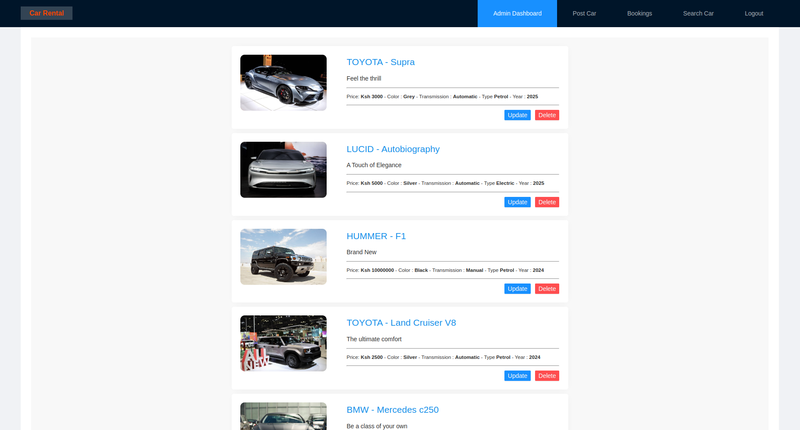
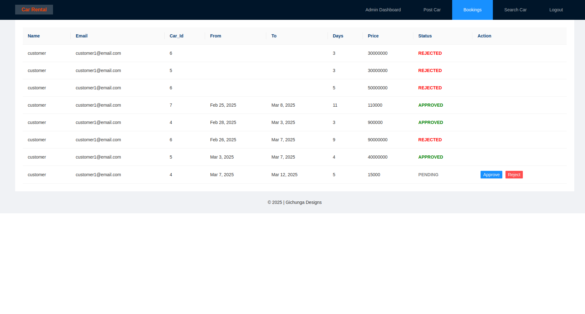
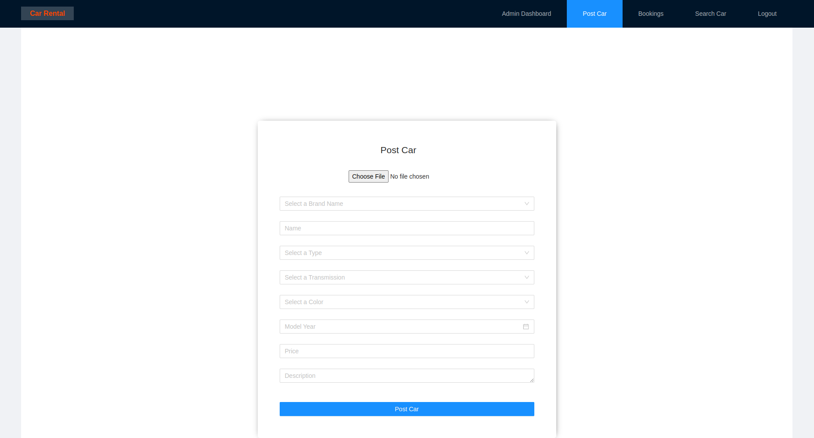
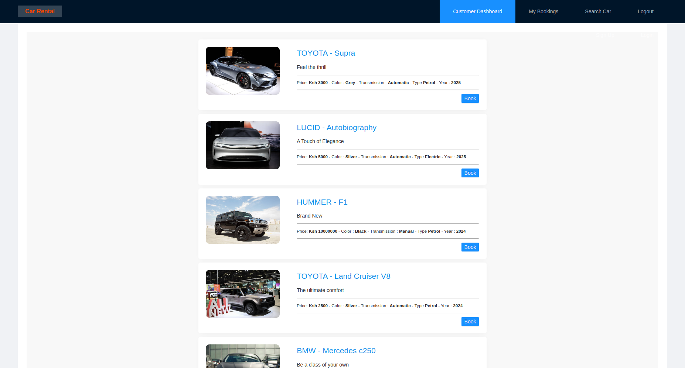
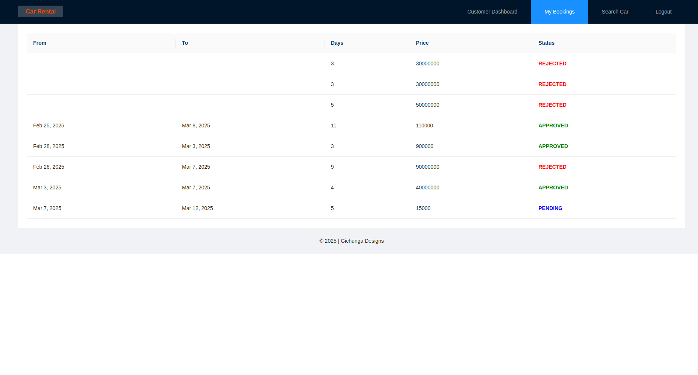
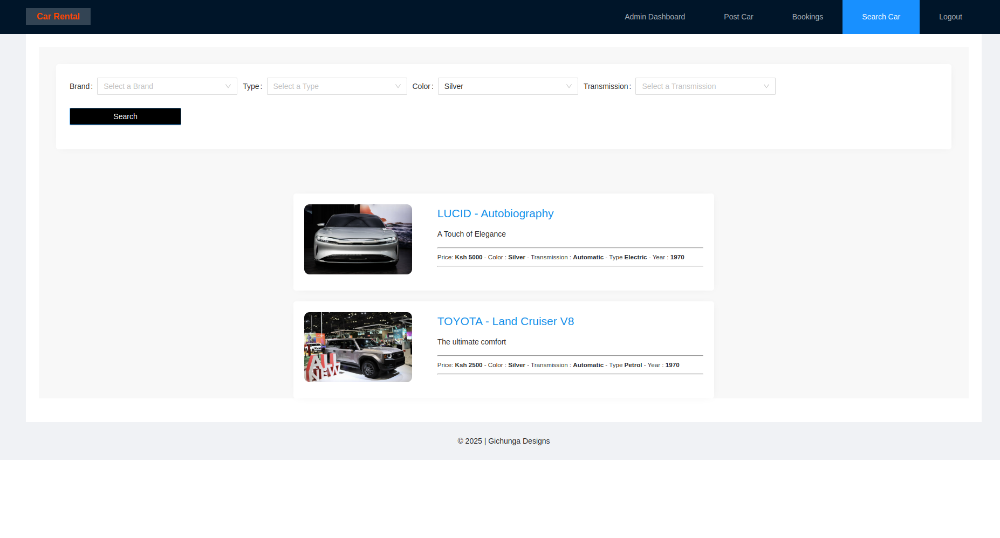

# Car Rental Service


## Description

CarRentalService is an automation tool that lets clients book vehicles from car dealers and return them at a later date. 

## Features

- User Registration and Login - Admin/Clients

  ## Admin 
- Dashboard Overview
- Vehicle Search
- Approve/Reject Bookings
- Posting Available Vehicles

  ## Customer
- Dashboard Overview
- Vehicle Search
- Bookings Vehicles
- Tracking Bookings
---

## Screenshots

### 1. Admin Dashboard


### 2. Bookings Approval or Rejection Interface


### 3. Car Record Creation


### 4. Customer Dashboard


### 5. Customer Bookings


### 5. Global Search


---

## Tech Stack

- Frontend: Angular, Ng Zorro
- Backend: Spring boot
- Database: MySQL
- Authentication: JWT

---

## Installation

Clone the project:

```bash
git clone https://github.com/gstv-codegeek/car-rental.git
cd car-rental
